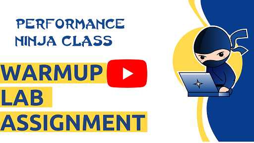

# Get started

## How to set up the environment

Here is the list of tools you *absolutely* have to install to build labs in this video course:
* CMake 3.13
* [Google benchmark](https://github.com/google/benchmark), you can also use the scripts in the [tools](tools) directory.

Others are optional depending on your platform of choice. So far we support native builds on Windows and Linux. Check out the instructions specific to each platform ([Windows](QuickstartWindows.md)) ([Linux](QuickstartLinux.md)) ([MacOS](QuickstartMacOS.md)).

## How to build lab assignments

Watch the warmup video:

[](https://www.youtube.com/watch?v=jFRwAcIoLgQ&list=PLRWO2AL1QAV6bJAU2kgB4xfodGID43Y5d)

Every lab assignment has the following:
* Video that introduces a particular transformation.
* Baseline version of a workload that has a particular performance bottleneck in it. You need to find it and fix the source code accordingly.
* Summary video that explains the solution for the lab.

We encourage you to work on the lab assignment first, without watching the summary video.

Every lab can be built and run using the following commands:
```
cmake -E make_directory build
cd build
cmake -DCMAKE_BUILD_TYPE=Release ..
cmake --build . --config Release --parallel 8
cmake --build . --target validateLab
cmake --build . --target benchmarkLab
```
When you push changes to your private branch, it will automatically trigger a CI benchmarking job. More details about it are at the bottom of the page.

## Profiling

To match assembly code back to the source in the profile, build your binaries with the debug information:
```
cmake -DCMAKE_BUILD_TYPE=Release -DCMAKE_C_FLAGS="-g" -DCMAKE_CXX_FLAGS="-g" ..
```

Lab assignments are built on top of the Google Benchmark library, which by default performs a variable number of benchmark iterations. That makes it hard to compare the performance profiles of two runs since they will not do the same amount of work. You can see the same wall time even though the number of iterations is different. To fix the number of iterations, you can make the following changes:

```
  BENCHMARK(bench1)->Iterations(10);
```

This will instruct the Google Benchmark framework to execute exactly 10 iterations of the benchmark. Now when you improve your code you can also compare performance profiles since the wall time will be different.

## Target platforms

You are free to work on whatever platform you have at your disposal. However, we use the following CI machines to run your submissions:

**Machine 1 - (Linux + Alderlake)**

* 12th Gen Intel(R) Core(TM) i7-1260P CPU @ 2.10GHz (4.70GHz Turbo), 4P+8E cores, 18MB L3-cache
* 16 GB RAM, DDR4 @ 3200 MT/s
* 256GB NVMe PCIe M.2 SSD
* Ubuntu 24.04 LTS, kernel version 6.8
* Clang C++ compiler, version 17.0

**Machine 2 - (Mac OS + M1)**

* Mac mini (M1, 2020) @ 3.20GHz max frequency, 4P+4E cores, 8 MB LLC
* 16 GB RAM, LPDDR4
* 256GB NVME APPLE SSD AP0256Q
* macOS 13.5.1 Ventura (22G90)
* Clang C++ compiler, version 17.0

**Machine 3 - (Windows + Zen3)**

* AMD Ryzen 7 3700X 8-Core Processor @ 3.6GHz (4.40GHz Turbo), 32MB L3-cache
* 64 GB RAM
* ADATA XPG SX8200 Pro 1TB 3D NAND NVMe SSD
* Windows 11 Version 21H2, build 22000.282
* Clang C++ compiler, version 17.0

**Machine 4 - (Linux + CoffeeLake)**

* Intel(R) Core(TM) i5-8259U CPU @ 2.30GHz (3.80GHz Turbo), 6MB L3-cache
* 16 GB RAM, DDR4 @ 2400 MT/s
* 256GB NVME INTEL SSDPEKKW256G8
* Ubuntu 20.04, kernel version 5.13
* Clang C++ compiler, version 17.0

Keep in mind that sometimes you may see different speedups on different platforms.

## Local experiments:

Here are a few tips that will help you compare the results of your experiments against the baseline. You can run the baseline version and write down the results, which you will later use to compare with your experiments. But there is a better way to automate this process. You can choose between two options:

1) Use the `compare.py` script, which is a part of the Google benchmark library:

    ```
    # 1. Benchmark the baseline and save the score into a JSON file
    ./lab --benchmark_min_time=1 --benchmark_out_format=json --benchmark_out=baseline.json
    # 2. Change the code
    # 3. Benchmark your solution and save the score into a JSON file
    ./lab --benchmark_min_time=1 --benchmark_out_format=json --benchmark_out=solution.json
    # 4. Compare solution.json against baseline.json
    /path/to/benchmark/tools/compare.py benchmarks baseline.json solution.json
    ```

2) Use the `check_speedup.py` script, which is inside the Performance Ninja repo (uses the `compare.py` script under the hood):

    ```
    # 1. Put your solution under `#ifdef SOLUTION`:
      #ifdef SOLUTION
        // your solution
      #else
        // baseline version
      #endif
    # 2. Run the script, which will build and run your solution against the baseline N times
    cd build
    python3 ~/workspace/perf-ninja/tools/check_speedup.py -lab_path ../ -num_runs 3
    ```

## Submission guidelines:

**IMPORTANT:** Send a request to be added as a collaborator to this Github repo. Otherwise, you won't be able to push your private branch[es]. Send your github handle to dendibakh@gmail.com with the topic "[PerfNinjaAccessRequest]". Do not fork the repo and submit a pull request with your solution, the CI job won't be triggered.

Push your submissions into your own branch[es]. CI job will be triggered every time you push changes to your remote Github branch. For now, we use a self-hosted runner, which is configured specifically for benchmarking purposes.

By default, CI will detect which lab was modified in the last commit and will only benchmark affected assignment. If you make changes to more than one lab, the CI job will benchmark all the labs. You can also force benchmarking all the labs if you add `[CheckAll]` in the commit message.

In case all the labs were benchmarked, a summary will be provided at the end, e.g.:

```
Lab Assignments Summary:
  memory_bound:
    data_packing: Passed
    sequential_accesses: Failed: not fast enough
  core_bound:
    function_inlining: Failed: build error
  misc:
    warmup: Skipped
```
