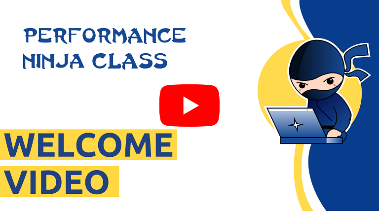

  

    

# Performance Ninja Class

This is an online course where you can learn to find and fix low-level performance issues, for example CPU cache misses and branch mispredictions. It's all about practice. So we offer you this course in a form of lab assignments and youtube videos. You will spend at least 90% of the time analyzing performance of the code and trying to improve it.

Each lab assignment focuses on a specific performance problem and can take anywhere from 30 mins up to 4 hours depending on your background and the complexity of the lab assignment itself. Once you're done improving the code, you can submit your solution to Github for automated benchmarking and verification.

Performance Ninja is supported on Linux, Windows, and Mac, and is run on all the recent HW including Intel's 12th-gen Alderlake, AMD's Zen3, and Apple's M1 CPUs. You can observe the effect of your optimizations on a variety of modern platforms.

Prerequisites: basic C++ skills are an absolute must-have for the course. Denis' [book](https://book.easyperf.net/perf_book) "Performance Analysis and Tuning on Modern CPUs" is recommended as an introduction to performance analysis basics. Knowledge of compilers, computer architecture, and the ability to read assembly code is a plus.

Before you start working on lab assignments, make sure you read [Get Started page](GetStarted.md) and watch the [warmup video](https://youtu.be/jFRwAcIoLgQ).

Lab assignments in this project are implemented in C++. Also, Performance Ninja was ported to:
* Rust ([perf-ninja-rs](https://github.com/grahamking/perf-ninja-rs)), thanks to @grahamking.
* Zig ([perf-ninja-zig](https://github.com/JonathanHallstrom/perf-ninja-zig)), thanks to @JonathanHallstrom.

## Lab assignments

* Core Bound:
  * [Vectorization 1](labs/core_bound/vectorization_1)
  * [Vectorization 2](labs/core_bound/vectorization_2)
  * [Function Inlining](labs/core_bound/function_inlining_1)
  * [Dependency Chains 1](labs/core_bound/dep_chains_1)
  * [Dependency Chains 2](labs/core_bound/dep_chains_2)
  * [Compiler Intrinsics 1](labs/core_bound/compiler_intrinsics_1)
  * [Compiler Intrinsics 2](labs/core_bound/compiler_intrinsics_2)
* Memory Bound:
  * [Data Packing](labs/memory_bound/data_packing) (currently broken)
  * [Loop Interchange 1](labs/memory_bound/loop_interchange_1)
  * [Loop Interchange 2](labs/memory_bound/loop_interchange_2)
  * [Loop Tiling](labs/memory_bound/loop_tiling_1)
  * [SW memory prefetching](labs/memory_bound/swmem_prefetch_1)
  * [False Sharing](labs/memory_bound/false_sharing_1)
  * [Huge Pages](labs/memory_bound/huge_pages_1)
  * [Memory Order Violation](labs/memory_bound/mem_order_violation_1)
  * [Memory Alignment](labs/memory_bound/mem_alignment_1)
* Bad Speculation:
  * [Branches To CMOVs](labs/bad_speculation/branches_to_cmov_1)
  * [Conditional Store](labs/bad_speculation/conditional_store_1)
  * [Replacing Branches With Lookup Tables](labs/bad_speculation/lookup_tables_1)
  * [C++ Virtual Calls](labs/bad_speculation/virtual_call_mispredict)
* CPU Frontend Bound:
* Data-Driven optimizations:
* Misc:
  * [Warmup](labs/misc/warmup)
  * [LTO](labs/misc/lto)
  * [PGO](labs/misc/pgo)
  * [Optimize IO](labs/misc/io_opt1)

## Support the project

Performance Ninja is in a very much work-in-progress state. We will be adding new lab assignments and videos! The course is free by default, but we ask you to support us on [Github Sponsors](https://github.com/sponsors/dendibakh), [Patreon](https://www.patreon.com/dendibakh) or [PayPal](https://www.paypal.com/cgi-bin/webscr?cmd=_donations&business=TBM3NW8TKTT34&currency_code=USD&source=url). Your sponsorship will speed up adding new lab assignments.

Current sponsors:
* Pavel Davydov (@pdavydov108)
* Matias Christensen
* Maya Lekova (@MayaLekova)
* Aaron St. George (@AaronStGeorge)

Thanks to Mansur Mavliutov (@Mansur) for providing an AMD-based machine for running CI jobs.

Lab authors:
* Andrew Evstyukhin (@andrewevstyukhin)
* Ivica Bogosavljevic (@ibogosavljevic)
* René Rahn (@rrahn)
* Adam Folwarczny (@adamf88)
* Jakub Beránek (@Kobzol)
* Jakub Gałecki (@kubagalecki)
* Denis Bakhvalov (@dendibakh)

## Contributing

We warmly welcome contributions! See [Contributing.md](Contributing.md) for the details.

Please write to dendibakh@gmail.com with suggestions.

Copyright © 2022 by Denis Bakhvalov under Creative Commons license (CC BY 4.0).
