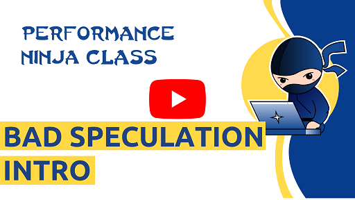

# Bad Speculation

This is a collection of labs, which experience large amount of branch mispredictions. We will be covering branchless algorithms. Here are some of the topics we plan to cover:

* Replace branches with look-up tables
* Replace branches with arithmetics
* Replace branches with predication

**Work in progress...**

Let us know if you have any suggestion for a new lab assignment.
