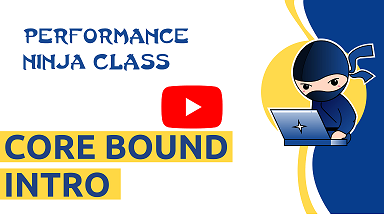

# Core Bound

This is a collection of labs with performance bound by core execution unit. Here are some of the topics we plan to cover:

* Vectorization
* Function Inlining
* Loop Unrolling
* Loop multiversioning
* Compiler Intrinsics

**Work in progress...**

Let us know if you have any suggestion for a new lab assignment.
