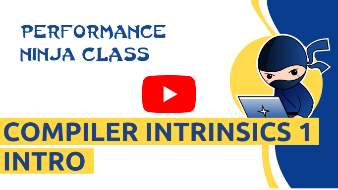
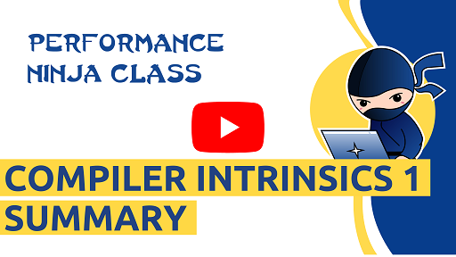

This is a lab about using [compiler intrinsics](https://en.wikipedia.org/wiki/Intrinsic_function) to speed up parts of the code, where compilers fail to generate optimal code.

The kernel in this lab assignment is a part of the Average ImageSmoothing algorithm, which is reduced to 1 dimension and lacks division part. The algorithm uses sliding window approach to compute a sum in the subrange [-radius .. +radius]. It is a very fast approach compared to a classical Gaussian blur.

Author: @adamf88.