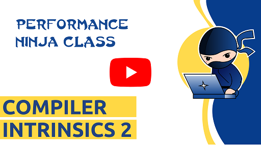

This is a second lab about using [compiler intrinsics](https://en.wikipedia.org/wiki/Intrinsic_function) to speed up parts of the code, where compilers fail to generate optimal code.

The task of this lab assignment is to find the longest line in a file. There is a way to find end-of-line characters in a parallel way if you utilize compiler intrinsics.

Bonus exercise: whether solution that uses intrinsics is faster than the baseline is heavily affected by the input data. Run your solution on different input files to determine the speedup/slowdown.

The idea for this lab was proposed by Yuriy Lyfenko (@obender12).

Co-authored-by: Andrew Evstyukhin (@andrewevstyukhin)

Co-authored-by: Jakub Beránek (@Kobzol)
