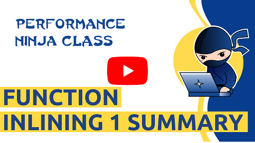

This is a lab about [function inlining](https://en.wikipedia.org/wiki/Inline_expansion) to speed up sorting.

Function inlining is a transformation that replaces a call to a function `F` with the body for `F` specialized with the actual arguments of the call. Inlining is one of the most important compiler optimizations, not only because it eliminates the overhead of calling a function (prologue and epilogue), but also it enables other optimizations.

Whenever you find in a performance profile a function with hot prologue and epilogue, consider such function as one of the potential candidates for being inlined. In this lab assignment you will practice fixing such performance issues.

