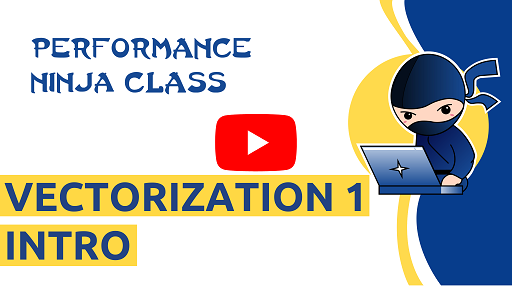

[Sequence alignment](https://en.wikipedia.org/wiki/Sequence_alignment) is an important algorithm in many bioinformatics applications and pipelines. The goal of the alignment is to gain insights about their biological  relation. In particular, one is interested how the sequences diverged from a common ancestor by evolutionary events like point mutations or insertions and deletions in the respective sequences.
This problem, however, has quadratic complexity and optimizing it can have a great benefit in many applications.
Since many bioinformatic problems start with the alignment of millions of short sequence pieces of length 150 to 300 symbols, we can gain great performance improvements by using SIMD vectors. In this lab you will learn how the algorithm can be improved by transforming the data layout and exposing SIMD computations.

Author: @rrahn.