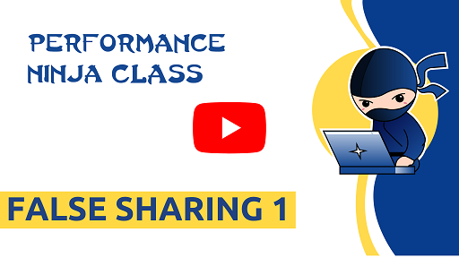

This lab assignment focuses on improving performance by eliminating false sharing. In this lab, we
have several threads that modify data located close together in memory in parallel. This causes a lot
of overhead, because the individual cores must transfer cache lines containing the modified data amongst
themselves to satisfy cache coherence.

Your task here is to eliminate the false sharing by making sure that each thread will access a separate
cache line.

Expected speedup: at least 60%.

Authored-by: Jakub Beránek (@Kobzol)