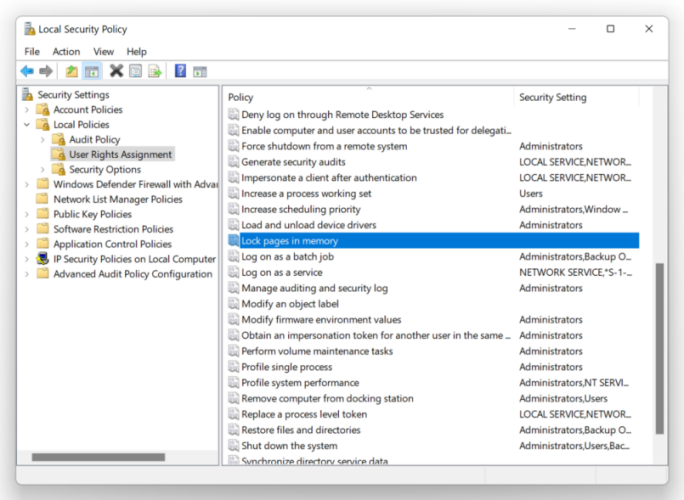
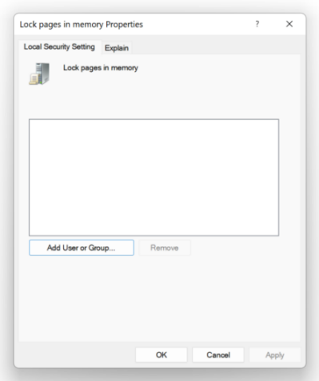

# Tips on enabling hugepages in the OS

## Windows

 To utilize huge pages on Windows, one needs to enable `SeLockMemoryPrivilege` [security policy](https://docs.microsoft.com/en-us/windows/security/threat-protection/security-policy-settings/lock-pages-in-memory).
 This can be done programatically via the Windows API, or alternatively via the security policy GUI (see guide below).

1. Hit start -> search "secpol.msc", launch it.
2. On the left select "Local Policies" -> "User Rights Assignment", then double-click on "Lock pages in memory"



3. Add your user and reboot the machine



4. Check that huge pages are used at runtime with [RAMMap](https://docs.microsoft.com/en-us/sysinternals/downloads/rammap)

## Linux

### Explicit hugepages

 To explicitly allocate a fixed number of huge pages, one can use [libhugetlbfs](https://github.com/libhugetlbfs/libhugetlbfs):

 ```bash
$ sudo apt install libhugetlbfs-bin
$ sudo hugeadm --create-global-mounts
$ sudo hugeadm --pool-pages-min 2M:128
```

This is roughly the equivalent of executing the following commands which do not require libhugetlbfs (see the [kernel docs](https://www.kernel.org/doc/Documentation/vm/hugetlbpage.txt)):

```bash
$ echo 128 > /proc/sys/vm/nr_hugepages
$ mount -t hugetlbfs                                                      \
    -o uid=<value>,gid=<value>,mode=<value>,pagesize=<value>,size=<value>,\
    min_size=<value>,nr_inodes=<value> none /mnt/huge
```

You should be able to observe the effect in `/proc/meminfo`:

```bash
$ watch -n1 "cat /proc/meminfo  | grep huge -i"
AnonHugePages:      2048 kB
ShmemHugePages:        0 kB
FileHugePages:         0 kB
HugePages_Total:     128    <== 128 huge pages allocated
HugePages_Free:      128
HugePages_Rsvd:        0
HugePages_Surp:        0
Hugepagesize:       2048 kB
Hugetlb:          262144 kB <== 256MB of space occupied
```

### Transparent hugepages

To allow application use transparent Huge Pages on Linux one should make sure, that `/sys/kernel/mm/transparent_hugepage/enabled` is `always` or `madvise`. 

In the system-wide mode (`always`) the kernel will automatically collpase regular pages and promote them into a huge page. It works even for applications that are not aware of THPs, so you don't have to change the code yourself. Enable system-wide mode with:
```bash
echo "always" | sudo tee /sys/kernel/mm/transparent_hugepage/enabled
```

With the `madvise` option, THP is enabled only inside memory regions attributed with `MADV_HUGEPAGE` via `madvise` system call. For example:

```cpp
void ptr = mmap(nullptr, size, PROT_READ | PROT_WRITE | PROT_EXEC,
                MAP_PRIVATE | MAP_ANONYMOUS, -1 , 0);
madvise(ptr, size, MADV_HUGEPAGE);
// use the memory region `ptr`
munmap(ptr, size);
```

When applications are allocating huge pages via `madvise` and `mmap`, you can observe the effect in `/proc/meminfo` under `AnonHugePages`.
