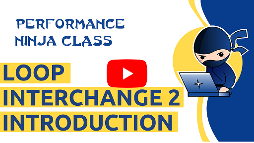
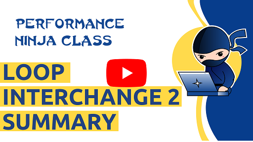

This is a lab about [loop interchange](https://en.wikipedia.org/wiki/Loop_interchange), which is more advanced than the previous one.

In this lab assignment you will optimize [Gaussian blur](https://en.wikipedia.org/wiki/Gaussian_blur) algorithm applied to a grayscale image.
Modern cameras have good matrices and produce big files. How fast can modern CPU filter a camera shot?
Significant speedup has been already achieved by two passes of 1-dimensional digital filter instead of a plain 2D convolution.

