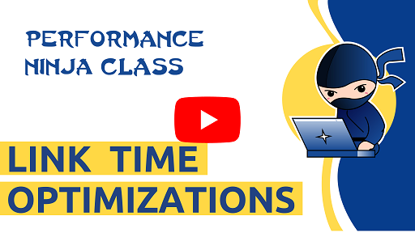

Link Time Optimization (LTO) is a collection of compiler transformations that are performed across multiple translation units. It is also frequently referred to as IPO ([Interprocedural optimizations](https://en.wikipedia.org/wiki/Interprocedural_optimization)). Traditionally, compilers perform optimization within one translation unit. LTO helps a lot in situations when many function calls cross translation unit boundaries. In this lab, you will see the effect of LTO in practice.

Suggested workflow for this exercise:
1. Profile the benchmark and examine the bottleneck.
2. Try to improve the code manually without using LTO.
3. Revert your changes and enable LTO (compiler option) instead.
4. Check the profile again to find out what changes were done by a compiler that led to perf speedup.

# AOBench
The code for this lab is taken from aobench, which was originally written by Syoyo Fujita:
[https://code.google.com/archive/p/aobench/](https://code.google.com/archive/p/aobench/)

License: New BSD License

Modifications for Performance Ninja:
- The original single source file is split into multiple to expose the performance problem that LTO can fix.
- drand48 is not available on Windows, so I implemented it myself.
- Compile the code with C++ compiler, not C compiler.
- Lowered the values for `WIDTH` and `HEIGHT` to 256 to decrease the runtime.

Co-authored-by: @dendibakh